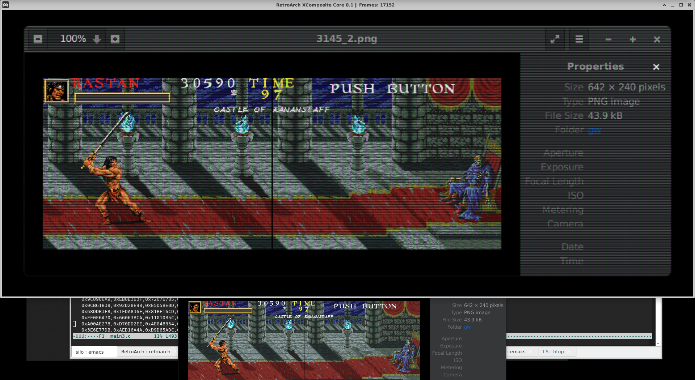
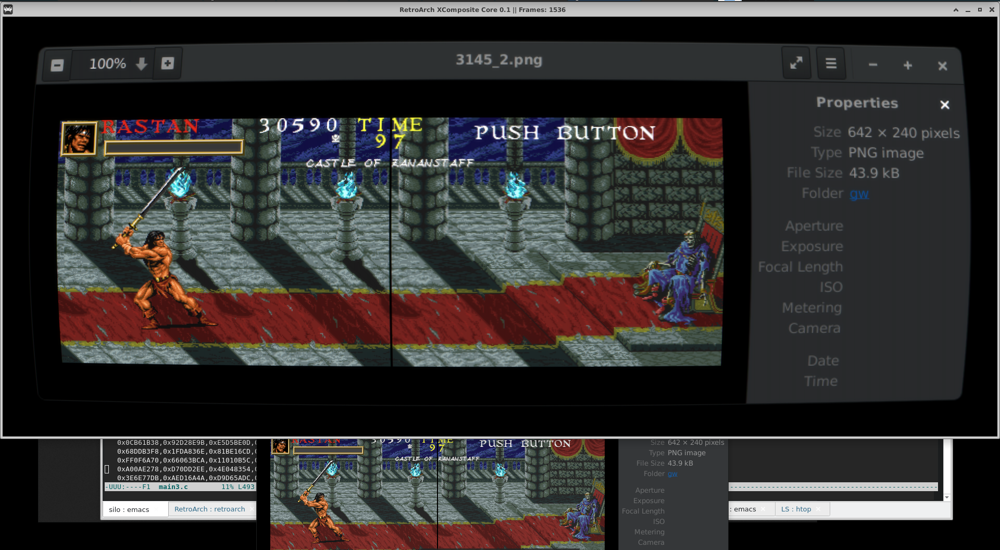
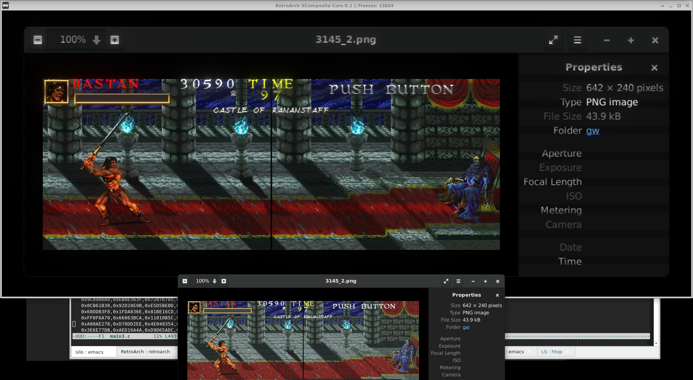
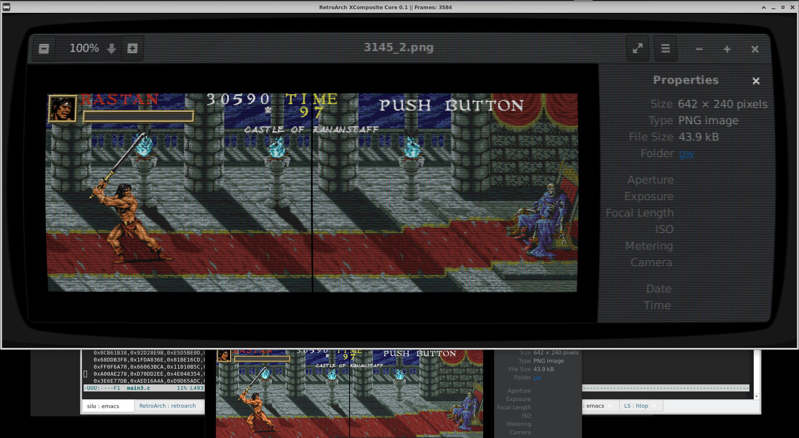
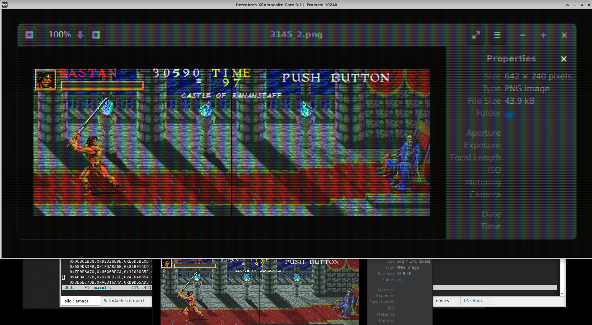
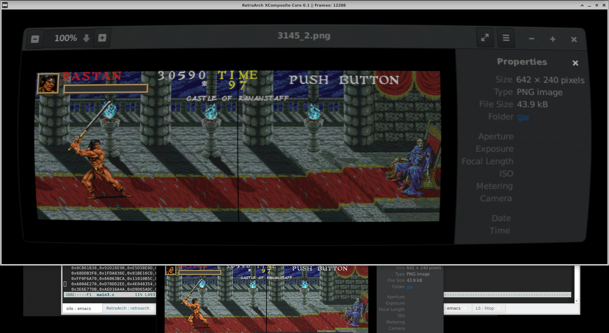

XCompy core
===========

A quick hack to apply shaders to X11 Window contents on Linux, as inspired by [ShaderGlass](https://github.com/mausimus/ShaderGlass) which is Windows-only.

Tested with RetroArch v1.7.3 and v1.20.0 on Ubuntu 22.04.5. This core has not been tested on other X11 systems.

Installation / Usage
------------
1. run `make`
2. Copy the xcompy_core.so to where you keep your cores.  On Ubuntu, it's: /usr/lib/x86_64-linux-gnu/libretro/
3. Load the core in RetroArch.
4. Open a window to target.
5. Select your desired renderer and shader from the RetroArch menu (F1)
6. Mouse-wheel scroll through the active windows.

Screenshots
-----------

